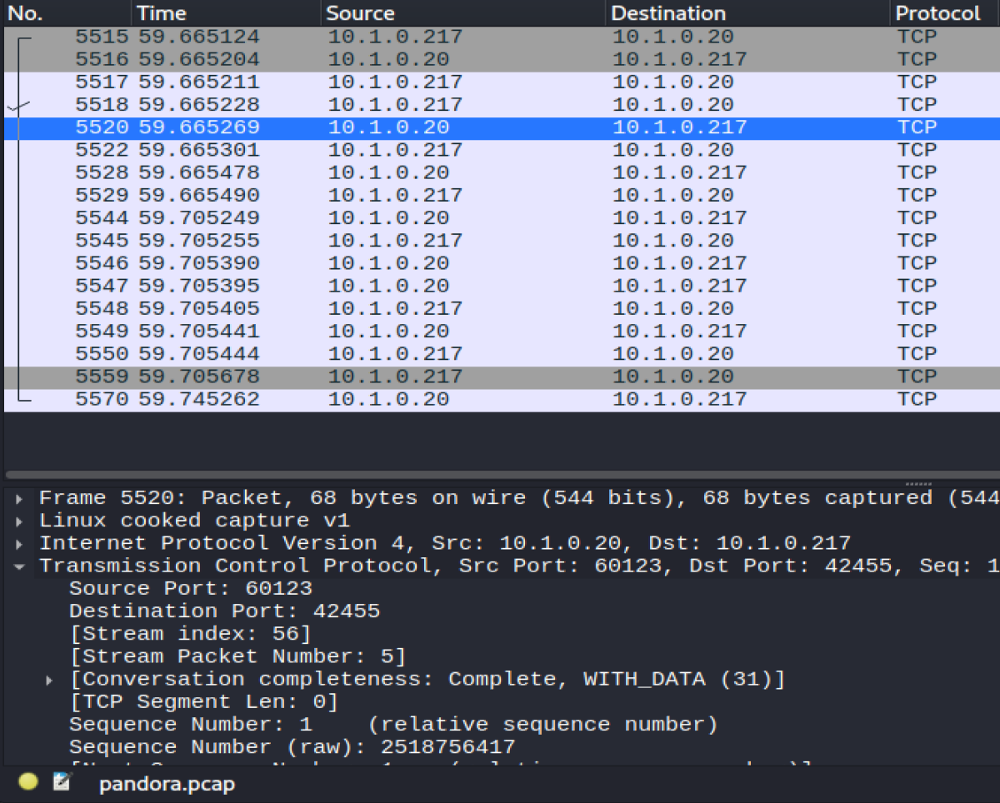

# Herb Cooper – Cybersecurity Portfolio

Welcome to my cybersecurity portfolio. I am a cybersecurity student at SANS Technology Institute building hands-on skills through labs, virtual machines, networking projects, and Capture The Flag (CTF) challenges. This site highlights some of the work I have completed and what I learned from it.

## About Me

I became interested in cybersecurity by seeing how much cybercrime has increased and how important it is to defend systems, networks, and information. I was especially drawn to the field because it requires knowledge across many technical areas, such as networking, programming, Linux, and web applications. I enjoy cybersecurity because it is both challenging and constantly changing, which pushes me to keep learning and developing new skills.

## What This Portfolio Shows

This portfolio is a record of my learning journey. It includes practical work such as:
- CTF challenge write-ups
- Lab projects
- Networking and system administration exercises
- Reflections on tools, techniques, and lessons learned

## CTF Experience Reflection

Participating in CTF challenges helped me build confidence in problem solving, research, and technical persistence. CTFs taught me how to break down unfamiliar problems, test ideas methodically, and learn from mistakes. They also helped me become more comfortable using security tools and documenting my workflow clearly.

## Highlights

- Completed cybersecurity labs involving Linux, networking, and virtualization
- Practiced investigative and analytical thinking through CTF challenges
- Improved documentation skills by writing technical summaries and walkthroughs

## Featured Write-Up

- [Cyber Skyline CTF Write-Up](./ctf/cyber-skyline-writeup.html)

## Performance / Scouting Reports

The following public performance materials reflect my participation in cybersecurity competitions and challenge-based learning:

- [Cyber Skyline / NCL Scouting Report](PASTE-YOUR-PUBLIC-LINK-HERE)

## Contact / Professional Links

- [GitHub Profile](https://github.com/hcoop-504)
- [LinkedIn](https://www.linkedin.com/in/herbert-cooperii)

## Projects

### GNS3 Networking Lab

This project highlights hands-on networking labs built in GNS3 and VirtualBox to practice topology design, connectivity, routing, and troubleshooting.

