# GNS3 Network Hardening Lab: pfSense, Snort, and Tripwire

## Overview

This project highlights a security-focused GNS3 lab built to practice network and system hardening using pfSense, Snort, and Tripwire. The lab was designed to simulate an enterprise-style environment in which firewall rules, network segmentation, intrusion detection, and host-based integrity monitoring could be configured and tested in a controlled setting. Through this project, I gained hands-on experience with defensive security concepts including traffic filtering, DMZ design, NAT, intrusion detection and prevention, and host-based file integrity monitoring.

## Objectives

- Build a virtual enterprise security lab in GNS3
- Configure pfSense to segment and secure internal network traffic
- Implement DMZ and NAT rules for controlled access
- Deploy Snort for network intrusion detection and prevention
- Use Tripwire as a host-based intrusion detection system
- Practice validating security controls through testing and monitoring

## Lab Environment

This lab was built in GNS3 and included multiple systems to simulate an enterprise-style network. Key components included:

- **GNS3** for topology design and lab simulation
- **pfSense** as the firewall and routing platform
- **Snort** for network intrusion detection and prevention
- **Tripwire** for host-based integrity monitoring
- Internal LAN, management, DMZ, and internet-connected segments
- Windows and Linux systems used for testing connectivity and security controls

## Key Tasks Completed

Across this lab, I completed security-focused tasks such as:

- Configured pfSense interfaces and services
- Set up DHCP services within the pfSense environment
- Verified connectivity between hosts in the LAN and management networks
- Created and tested firewall and DMZ rules
- Configured NAT rules to manage traffic flow between internal and external networks
- Verified access to internal services from the internet test host where appropriate
- Implemented Snort to generate alerts and block suspicious traffic
- Observed Snort alert notifications and verified blocking behavior against test traffic
- Used Tripwire to establish a baseline database and detect file integrity changes
- Verified Tripwire scans under both normal conditions and policy violation scenarios
- Configured a scheduled Tripwire job through crontab

## Skills Demonstrated

This project helped me build and demonstrate skills in:

- Network hardening
- Firewall administration
- pfSense configuration
- Network segmentation and DMZ design
- NAT and access control
- Intrusion detection and prevention
- Host-based intrusion detection
- Security monitoring and validation
- Troubleshooting and documentation

## Project Walkthrough

### 1. GNS3 Workspace and Lab Topology

The lab began with building the security environment in GNS3. This provided the overall layout for the protected network and made it possible to visualize how pfSense, internal hosts, management systems, and internet-facing resources interacted.

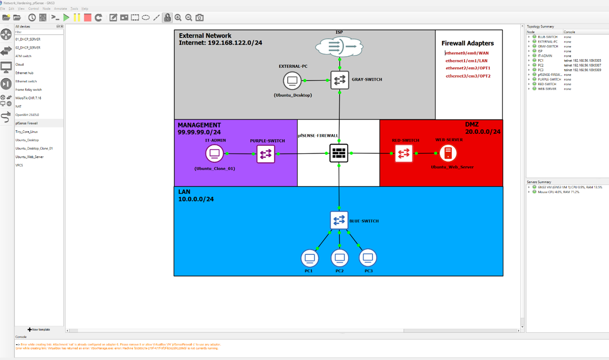

This topology formed the foundation for later phases of the project, including internal hardening, internet access control, intrusion detection, and host integrity monitoring.

### 2. pfSense Internal Network Configuration

After the topology was in place, pfSense was configured to support the internal environment. This included enabling services such as DHCP so that systems inside the lab could communicate using correct addressing and network settings.

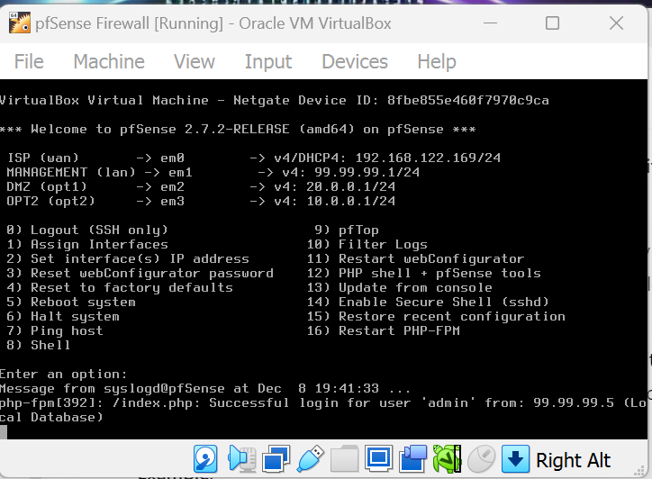


This screenshot shows pfSense after DHCP services were configured for the internal network. At this stage of the lab, pfSense was functioning as a central security and infrastructure component by helping internal systems receive network configuration automatically. This is important in a segmented lab because hosts on the LAN, management, and other protected networks need correct IP addressing and gateway information before firewall policy testing can begin.

### 3. Connectivity Testing Between Systems

After internal services were configured, connectivity testing was performed to verify that the systems in the lab could communicate as expected. In this phase, the web server successfully pinged both a LAN PC and the management PC, confirming that addressing, routing, and internal communication paths were working correctly.

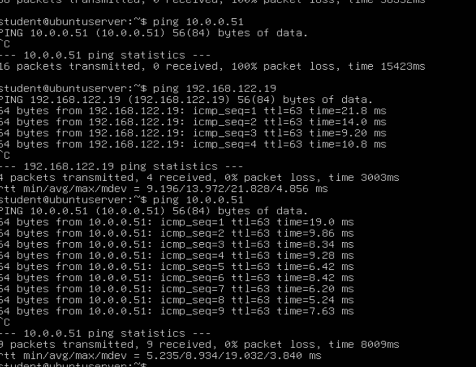

This step was important because it validated the baseline network functionality before more restrictive security controls were applied. In security hardening work, it is useful to first confirm that the environment works normally so later changes can be evaluated accurately.

### 4. DMZ Firewall Rules

Once basic connectivity was confirmed, firewall policy was tightened through the use of DMZ rules in pfSense. The DMZ is designed to host systems that may need more external exposure than internal hosts, while still limiting their access to protected parts of the network.

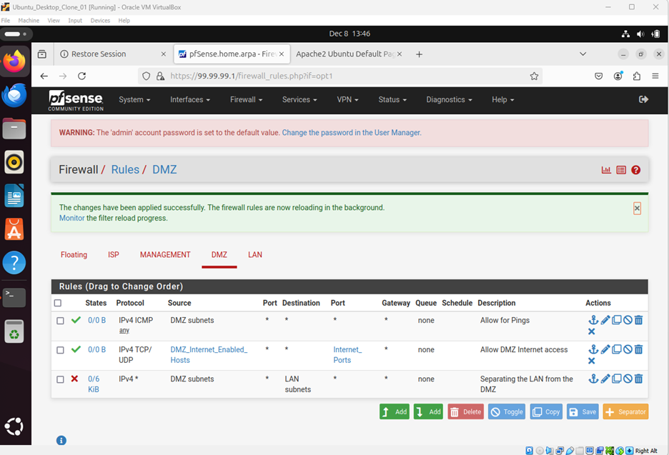

These rules demonstrate how pfSense can be used to enforce segmentation and reduce unnecessary trust between network zones. Instead of allowing unrestricted communication, traffic is filtered according to defined policy, which is a core part of network hardening.

### 5. NAT and Internet Access Control

The next phase of the lab focused on NAT configuration and controlled access between internal services and external systems. NAT rules were created in pfSense to manage how traffic moved between the internal lab network and the simulated internet-facing environment.

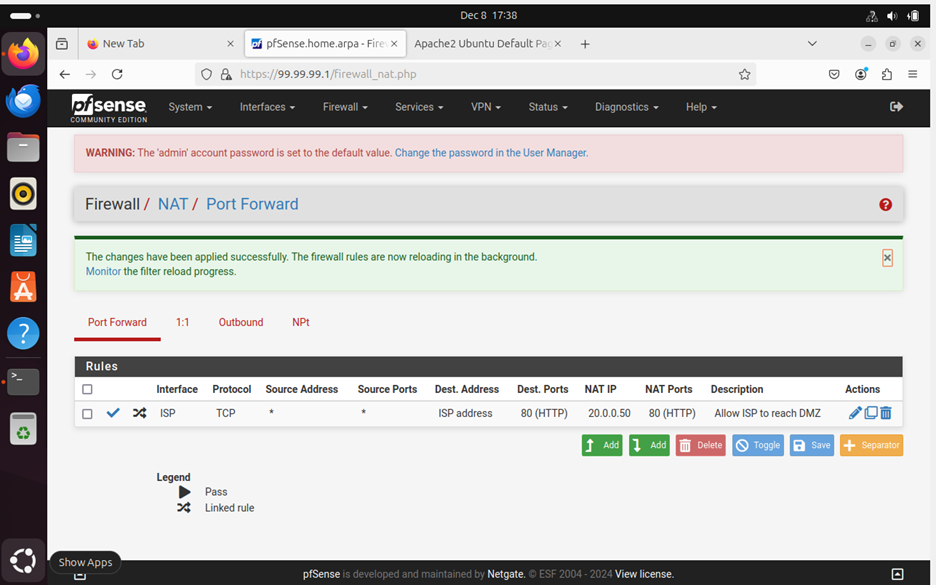

This screenshot highlights how NAT was configured to translate and direct traffic appropriately. In a real environment, this type of configuration helps expose only the services that are intended to be reachable while keeping internal addressing hidden and reducing unnecessary exposure.

### 6. Internet Host Access to the Ubuntu Web Server

After NAT was configured, access testing was performed from the internet host to the Ubuntu Server webpage. This demonstrated that the firewall and NAT configuration allowed the intended service to be reached while still preserving segmentation and policy control.

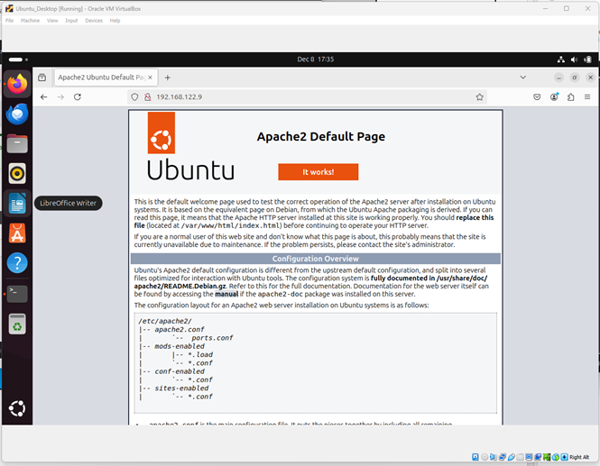

This phase showed the balance between security and usability. A hardened environment still needs to allow legitimate access to approved services, and this test confirmed that the published web service could be reached through the configured rules.

### 7. Snort IDS/IPS Deployment

A major part of this lab was implementing Snort as a network intrusion detection and prevention tool. Snort was integrated with the pfSense environment to provide visibility into suspicious or malicious traffic and to strengthen network monitoring capabilities.

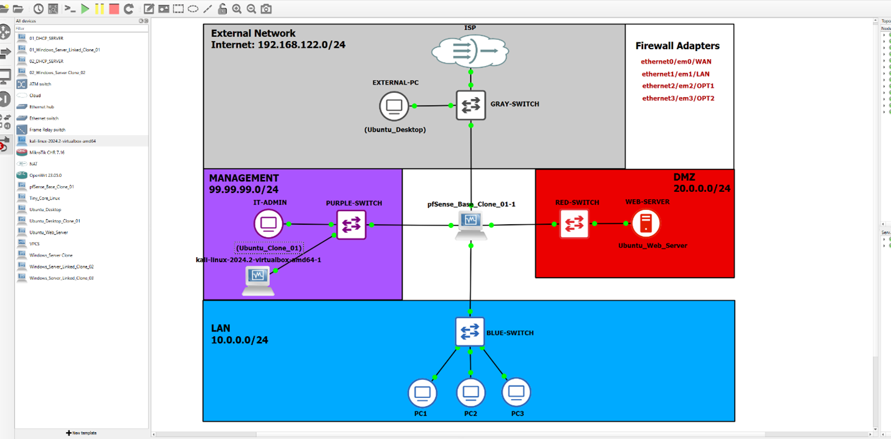


This portion of the lab added a detection and response layer to the firewall-based protections already in place. While pfSense controlled which traffic was allowed, Snort provided additional analysis to identify potentially malicious behavior on the network.

### 8. Snort Alerts and Defensive Visibility

Once Snort was active, the lab generated alert data that could be reviewed through the pfSense interface. These alerts provided visibility into suspicious network activity and demonstrated how IDS/IPS tools help security teams move beyond simple traffic filtering into active monitoring.

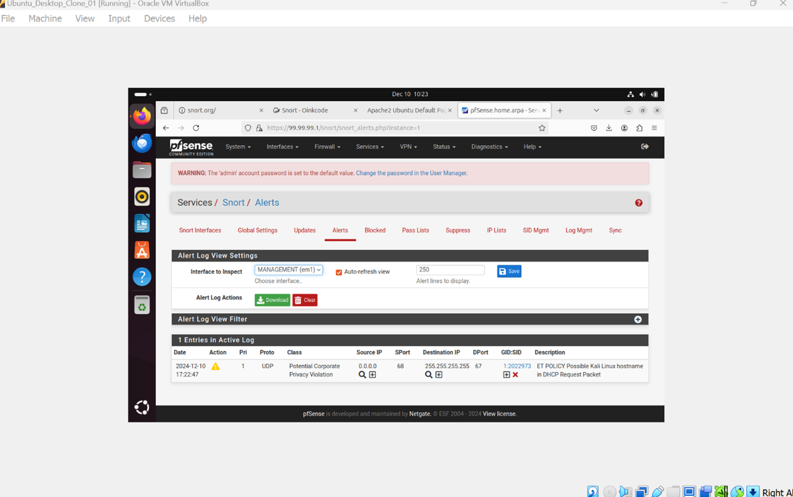

This stage of the lab reinforced the importance of monitoring in a hardened environment. Firewall rules alone do not provide full insight into what is happening on the network, so alerts and event visibility are critical for identifying possible attacks or policy violations.

### 9. Snort Blocking Malicious or Suspicious Traffic

The lab also demonstrated Snort’s ability to block unwanted traffic, including test activity generated from Kali. This showed the transition from passive detection into active prevention.

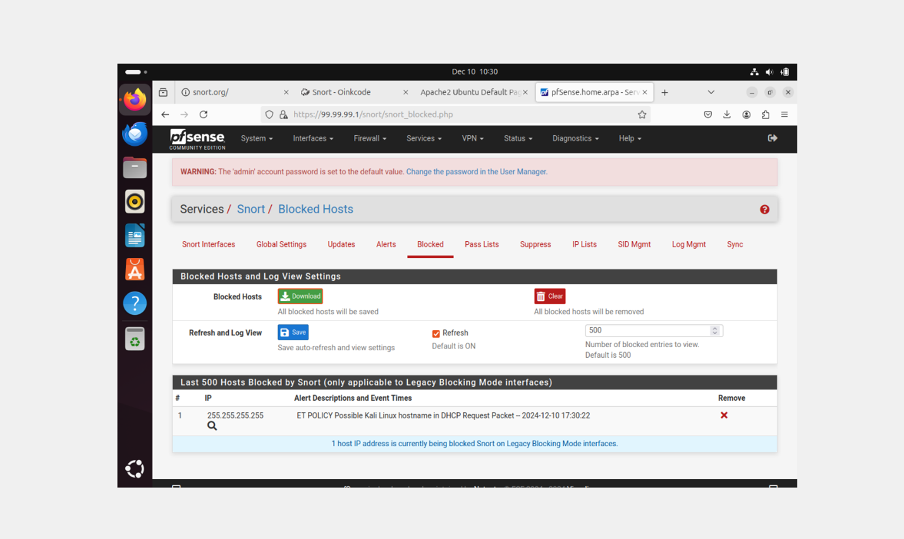

This is an important defensive capability because it shows how the environment can automatically respond to suspicious traffic instead of only logging it. In a layered security model, this adds stronger protection against hostile behavior inside or across network boundaries.

### 10. Tripwire HIDS Baseline Database

In addition to network-based monitoring, the lab included host-based intrusion detection using Tripwire. The first step was establishing a baseline database so that future scans could compare the system’s current state against a known trusted reference.

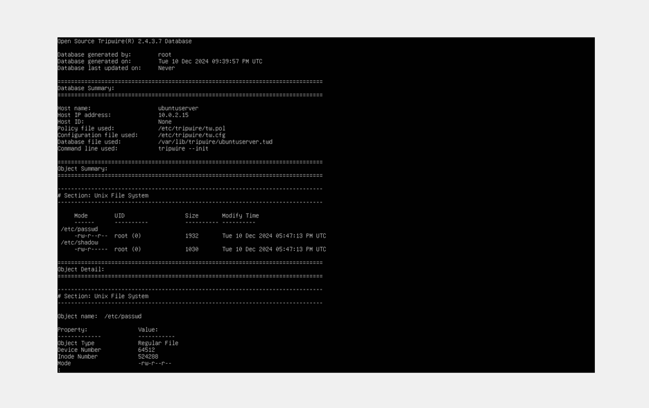

This is an important concept in host-based security because it allows administrators to detect unauthorized or unexpected changes to critical files and configurations. While Snort watches traffic on the network, Tripwire monitors the integrity of the host itself.

### 11. Tripwire Scan Showing No Errors

After the baseline was created, a scan was run under normal conditions to confirm that the monitored system matched the expected state.

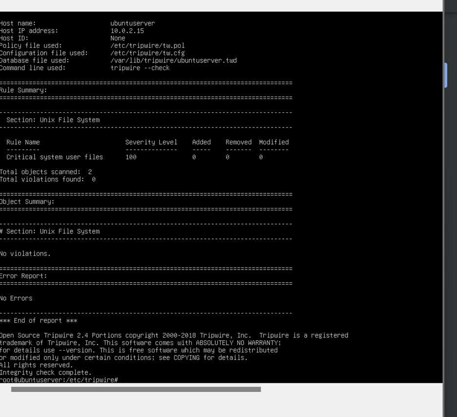

This clean result showed that the host remained consistent with the established baseline. It also demonstrated how integrity monitoring can be used as part of routine validation to confirm that protected systems have not been altered unexpectedly.

### 12. Tripwire Policy Violation Detection

To demonstrate the detection capability of Tripwire, the lab included a scan that showed a policy violation. This proved that Tripwire could detect changes that differed from the approved baseline.

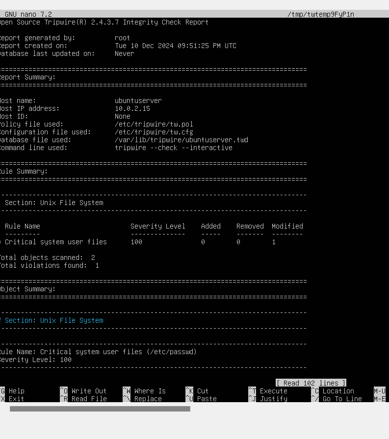

This part of the lab illustrated the value of host-based intrusion detection in a defense-in-depth strategy. Even if suspicious activity does not immediately appear at the network level, unauthorized host changes can still be identified through integrity monitoring.

### 13. Scheduled Tripwire Monitoring with Cron

The final stage of the Tripwire exercise involved scheduling the scan through cron so that integrity monitoring could occur automatically rather than only through manual checks.

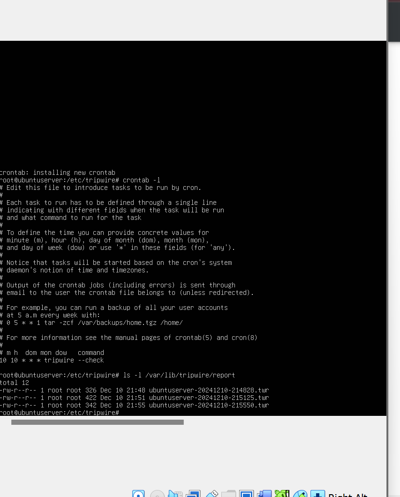

This helped demonstrate an operational security mindset by moving from one-time testing to recurring monitoring. Automated checks improve consistency and make it more practical to maintain visibility over important systems over time.

## Reflection

This project helped me connect networking knowledge with practical defensive security techniques in a realistic lab environment. By working with pfSense, Snort, and Tripwire together, I was able to see how multiple layers of defense can support one another through traffic filtering, segmentation, intrusion detection, and host integrity monitoring. The lab strengthened my understanding of blue team concepts and gave me hands-on experience with the types of tools and workflows used in enterprise network defense.
```md
